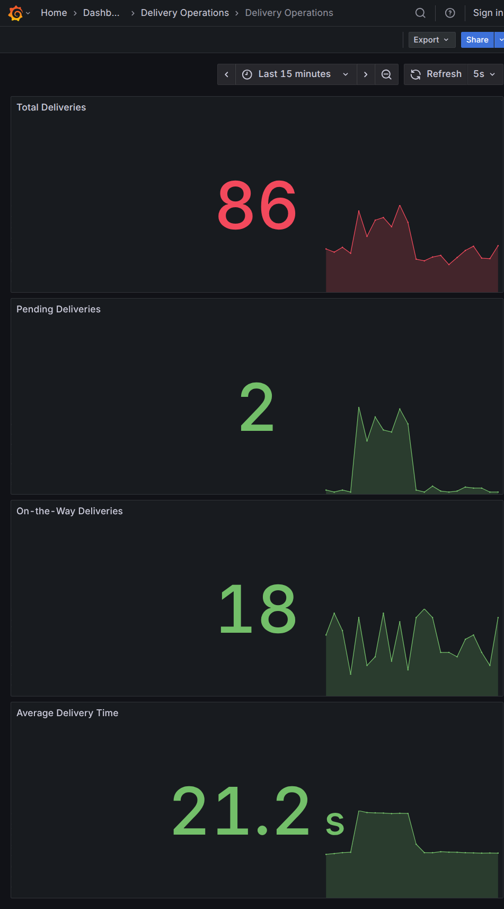

# Exercise 6: Real-Time Delivery Monitoring

## Objective

Simulate quick-commerce delivery activity and monitor it with Prometheus, Grafana, and a Jenkins pipeline. Prometheus scrapes the exporter, evaluates alert rules, and provides the data for a provisioned Grafana dashboard.

The commands and outputs below were captured on Linux with Docker Engine 29.8.0 and Docker Compose 5.5.1 on 2026-10-07. Metric values are random and will change on each run.

## Project Files

- [delivery_metrics.py](delivery_metrics.py): generates delivery gauges and delivery-time summary metrics.
- [Dockerfile](Dockerfile): builds the Python exporter.
- [prometheus.yml](prometheus.yml): configures Prometheus scrape/evaluation intervals and jobs.
- [alert_rules.yml](alert_rules.yml): defines high-pending and high-average-delivery-time alerts.
- [compose.yaml](compose.yaml): runs the exporter, Prometheus, Grafana, and Jenkins on a shared Docker network.
- [dashboards/delivery-operations.json](dashboards/delivery-operations.json): four-panel Grafana dashboard.
- [Jenkinsfile](Jenkinsfile): builds and smoke-tests the metrics image.
- [jenkins/Dockerfile](jenkins/Dockerfile): Jenkins image with Docker CLI and Pipeline plugin.

All web ports bind to `127.0.0.1`. Grafana is configured for anonymous Viewer access for this local exercise. Jenkins setup wizard is disabled so its seeded job can run automatically. This is a local lab configuration, not suitable for a shared or production host; do not expose Jenkins or mount the Docker socket into an untrusted Jenkins instance.

## 1. Validate and Build

From this directory:

```bash
docker compose config --quiet
docker compose build
```

Captured result:

```text
valid Compose configuration
Image delivery-metrics:local Built
Image delivery-jenkins:local Built
```

The first build attempt exposed a Docker ignore-rule mistake that hid the Jenkinsfile from its image build context. The ignore rule was corrected and the subsequent complete build succeeded.

## 2. Start the Monitoring and CI Stack

The Jenkins container needs the Docker socket's numeric group ID to access the host daemon. This command obtains that ID dynamically:

```bash
DOCKER_GID=$(stat -c '%g' /var/run/docker.sock) docker compose up -d
docker compose ps
```

Captured startup result:

```text
Network delivery-monitoring Created
Container delivery-metrics Started
Container jenkins Started
Container prometheus Started
Container grafana Started
```

All four services were `Up`; published ports were loopback-only:

```text
delivery-metrics   127.0.0.1:8000->8000/tcp
prometheus         127.0.0.1:9090->9090/tcp
grafana            127.0.0.1:3000->3000/tcp
jenkins            127.0.0.1:8080->8080/tcp
```

If your Docker socket uses a different group, the startup command sets `DOCKER_GID` to the correct value for Jenkins.

## 3. Verify the Metrics Exporter

The exporter is available at [http://localhost:8000/metrics](http://localhost:8000/metrics). Check the delivery metrics:

```bash
curl -fsS http://localhost:8000/metrics \
  | grep -E '^(# (HELP|TYPE) (total_deliveries|pending_deliveries|on_the_way_deliveries|average_delivery_time)|total_deliveries|pending_deliveries|on_the_way_deliveries|average_delivery_time_(sum|count))'
```

Captured sample:

```text
# HELP total_deliveries Total number of deliveries
# TYPE total_deliveries gauge
total_deliveries 56.0
# HELP pending_deliveries Number of pending deliveries
# TYPE pending_deliveries gauge
pending_deliveries 8.0
# HELP on_the_way_deliveries Number of deliveries on the way
# TYPE on_the_way_deliveries gauge
on_the_way_deliveries 15.0
# HELP average_delivery_time Observed delivery time in seconds
# TYPE average_delivery_time summary
average_delivery_time_count 12.0
average_delivery_time_sum 244.8614693570153
```

## 4. Verify Prometheus Scraping and Queries

Open [Prometheus Targets](http://localhost:9090/targets), or query the API:

```bash
curl -fsS http://localhost:9090/api/v1/targets \
  | jq -r '.data.activeTargets[] | [.labels.job, .labels.instance, .health] | @tsv'
```

Captured target health:

```text
delivery_service   delivery-metrics:8000   up
prometheus         localhost:9090          up
```

Prometheus query API returned the following normal-traffic sample:

```text
total_deliveries                                      50
pending_deliveries                                    5
on_the_way_deliveries                                 6
average_delivery_time_sum / average_delivery_time_count 22.439504194886595
```

The average uses the Summary's `_sum / _count` values, matching the panel and alert expressions.

## 5. Verify the Grafana Dashboard

Open [Grafana](http://localhost:3000/d/delivery-operations/delivery-operations). The Prometheus data source and dashboard are provisioned from files at startup; no manual datasource or dashboard creation is needed.

Captured health and provisioning results:

```text
Grafana database: ok
Grafana version: 12.1.1
Data source: Prometheus | prometheus | http://prometheus:9090 | default=true
Dashboard: Delivery Operations | uid=delivery-operations | panels=4
```

The panels display `total_deliveries`, `pending_deliveries`, `on_the_way_deliveries`, and `average_delivery_time_sum / average_delivery_time_count`.

Captured Grafana dashboard with all four panels:



## 6. Verify Prometheus Alert Rules

Open [Prometheus Alerts](http://localhost:9090/alerts). Both rules are loaded with healthy expressions. Under normal traffic, the captured state was:

```text
HighPendingDeliveries      inactive   ok
HighAverageDeliveryTime    inactive   ok
```

## 7. Simulate High Load and Capture Firing Alerts

Recreate only the exporter in its high-load scenario:

```bash
DOCKER_GID=$(stat -c '%g' /var/run/docker.sock) \
  DELIVERY_SCENARIO=high docker compose up -d --force-recreate delivery-metrics
```

The high-load generator emits 50-100 pending deliveries and 35-45 second delivery times. Prometheus returned this sample:

```text
DELIVERY_SCENARIO=high
pending_deliveries=84
average_delivery_time_sum / average_delivery_time_count=39.86910278703267
```

After the configured 15-second `for` period, both alerts fired:

```text
HighPendingDeliveries       warning    firing   High pending deliveries
HighAverageDeliveryTime    critical   firing   High average delivery time
```

The Prometheus `ALERTS` query returned value `1` for both firing alerts.

Restore the normal scenario after verification:

```bash
DOCKER_GID=$(stat -c '%g' /var/run/docker.sock) docker compose up -d --force-recreate delivery-metrics
```

Captured recovery result:

```text
HighPendingDeliveries      inactive   ok
HighAverageDeliveryTime    inactive   ok
```

## 8. Verify the Jenkins Pipeline

Jenkins seeds the `delivery-monitoring` Pipeline job at startup and runs it automatically. Open [Jenkins](http://localhost:8080/job/delivery-monitoring/).

Captured result:

```text
Job: delivery-monitoring
Build: #2
Result: SUCCESS
Building: false
Duration: 10.232 seconds
```

The pipeline checked Docker client/server availability, built `delivery-metrics:jenkins`, started a temporary exporter, and verified its `/metrics` endpoint:

```text
Successfully tagged delivery-metrics:jenkins
Metrics endpoint smoke test passed
Finished: SUCCESS
```

The job removes its temporary smoke-test container in its post-build cleanup stage.

## 9. Cleanup

The stack is currently left running so the dashboard, alerts, and Jenkins job can be inspected at the links above. Stop it when finished:

```bash
docker compose down
```

To also delete Prometheus, Grafana, and Jenkins stored state:

```bash
docker compose down -v
```

## Questions and Answers

1. **What is Prometheus scraping?** Prometheus periodically fetches an HTTP metrics endpoint and stores timestamped samples for querying and alert evaluation.
2. **Why use gauges for deliveries?** Pending and active delivery counts can increase or decrease, so a Gauge represents their current values.
3. **What does the Summary provide?** It exposes the observation count and sum; dividing `_sum` by `_count` gives the observed mean delivery time.
4. **What does Grafana add?** It queries Prometheus to display live operational metrics in dashboards.
5. **How do alert rules work?** Prometheus evaluates their expressions on each evaluation interval and changes an alert to firing after its expression has remained true for its configured `for` duration.

## Result

The exporter, Prometheus scrape targets, Grafana datasource/dashboard, both high-load alerts, and Jenkins image-build/smoke-test pipeline were all run and verified. Both alerts were also verified to return to inactive after normal traffic was restored.